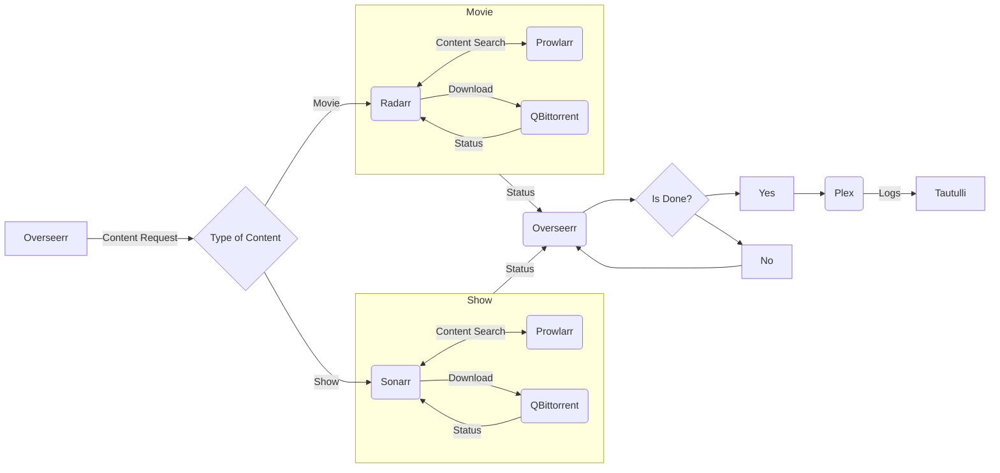

I like to watch movies and TV shows sometimes. Because of this, I decided it would be fun to setup a stack for streaming my own media.
!!!
I do not condone piracy, this is entirely educational.
!!!

I use the following tools together in a docker-compose stack:

 - Radarr
 - Sonarr
 - Tautulli
 - Overseerr
 - Prowlarr
 - Qbittorrent with Vuetorrent

My docker-compose file is the following:

:::code source="../Media/docker-compose.yml" :::

I use the default config files of everything as I have have no reason to change them.

Ports   | Assignment
        |
Sonarr Web Interface | 8989:8989
Radarr Web Interface | 7878:7878
Overseerr Web Interface | 5055:5055
Prowlarr Web Interface | 9696:9696

### Flowchart of the media stack operations.

